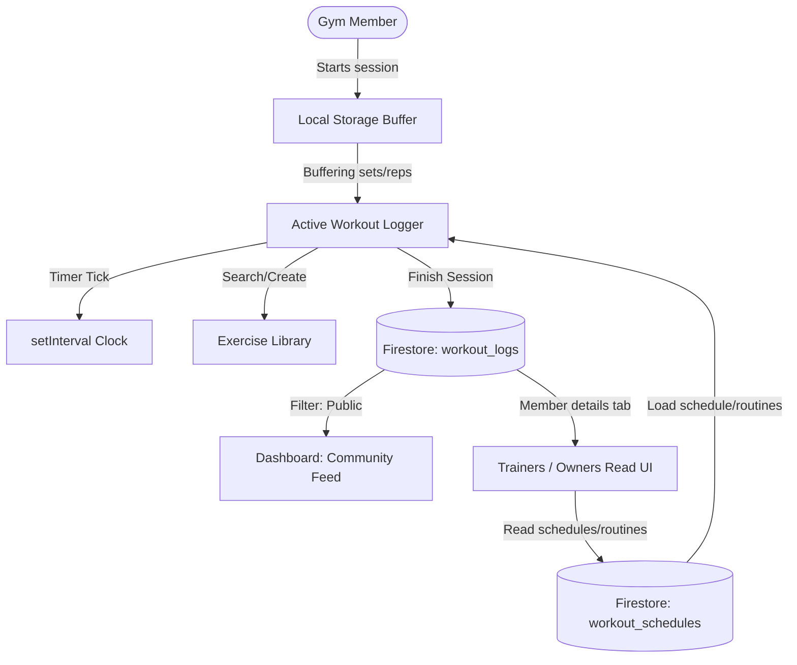

# Phase 11: Member Workout Logging & Exercise Library (Hevy-Style) - Research

**Researched:** 2026-07-28
**Domain:** Workout logging, exercise libraries, Firestore querying, client-side timers
**Confidence:** HIGH

## Summary

This phase implements unrestricted Hevy-style workout logging for members. A robust local-first experience allows members to start freestyle sessions, custom routines, or scheduled workouts. To support this, we utilize a pre-populated exercise library of ~80 exercises (loaded from `exercises-pruned.json`), support custom exercise creation, track session durations using real-time DOM timers, log set-by-set details (weight, reps, and RPE), and provide repeating/cloning of past workouts.

The social component consists of a gym-wide community feed integrated directly into the Dashboard where public logged workouts are shared. Finally, trainers and gym owners can view any member's workout logs and schedules via a dedicated, read-only "Workout Logs" tab added to the Member Details profile view under the Members Directory.

**Primary recommendation:** Leverage the existing Firestore collections (`workout_logs`, `workout_schedules`, and `exercise_library`) and ensure the trainer/owner check UI is fully integrated into the Member details modal (`showMemberProfileModal` in `modules/utils.js`) by adding the member's weekly schedule and custom routines.

## Architectural Responsibility Map

| Capability | Primary Tier | Secondary Tier | Rationale |
|------------|-------------|----------------|-----------|
| Exercise Library | Database / CDN | Browser | Pre-seeded json served statically; custom exercises persisted in Firestore. |
| Workout Logging | Browser | Database | Form state, timer interval, and local storage buffer run in the client; saved logs sync to Firestore. |
| Custom Routines | Database | Browser | Persistence in Firestore `workout_schedules` collection; creation & editing UI in Browser. |
| Weekly Scheduling | Database | Browser | Weekday mappings persisted in `workout_schedules`; edit & selector controls in Browser. |
| Repeat Cloning | Browser | Database | Past log fetched from Firestore, mapped to new active logger state in localStorage. |
| Community Feed | Database | Browser | Server-side read of public logs; dynamic card rendering in Browser. |
| Trainer/Owner View | Browser | Database | Read-only rendering of logs & schedules in Member Details modal. |

## Standard Stack

### Core
| Library | Version | Purpose | Why Standard |
|---------|---------|---------|--------------|
| Firebase Firestore | 10.12.5 | Real-time database persistence | Shared project standard; zero-cost scalable document store. [VERIFIED: codebase] |
| LocalStorage | Native | Active workout session buffering | Resilient against page refreshes and offline session logging. [VERIFIED: codebase] |
| Material Symbols | Native | UI iconography | Integrated Google Font iconography for timers, sets, and logs. [VERIFIED: codebase] |

### Supporting
| Library | Version | Purpose | When to Use |
|---------|---------|---------|-------------|
| `exercises-pruned.json` | Local | Seed exercise dataset | Static file loaded via fetch to populate ~80 base exercises. [VERIFIED: codebase] |

### Alternatives Considered
| Instead of | Could Use | Tradeoff |
|------------|-----------|----------|
| Firestore for logs | LocalStorage only | Prevents gym feed, trainer check, and cross-device sync. |
| React/Vite | Pure ES Modules | Introduces build step overhead; current pure ES architecture is highly maintainable. |

## Package Legitimacy Audit

No new external packages are installed for this phase. The implementation leverages native Browser APIs (fetch, localStorage, DOM events, setInterval) and the existing project Firebase SDK integration.

## Architecture Patterns

### System Architecture Diagram



### Recommended Project Structure
The files utilized and modified conform to the established pure-ES module layout:
```
modules/
├── my-workout.js       # Member workout logging, schedules, routines
├── dashboard.js        # Community feed rendering
├── utils.js            # showMemberProfileModal (trainer/owner read UI)
lib/
└── firebase-init.js    # Data collections and schema registration
firestore.rules         # Security rules isolation
```

### Pattern 1: Offline-First Session Sync
The active session is buffered in `localStorage` under `gymflow.active_workout`. When the user clicks "Finish", the session is written to Firestore (`workout_logs` collection), and the local buffer is cleared. This prevents session loss if the browser tab is closed or reloaded mid-workout.

### Anti-Patterns to Avoid
- **No In-Memory Active Workout State:** Never store the active workout *only* in JS memory. If the user accidentally refreshes or navigates away, they will lose their workout. Always sync to `localStorage` on every input/checkbox change.
- **No Unrestricted Rules:** Never allow trainers or owners to update members' workout logs or schedules. Access must be strictly read-only for trainers/owners, and read/write for the member.

## Don't Hand-Roll

| Problem | Don't Build | Use Instead | Why |
|---------|-------------|-------------|-----|
| Exercise data | Custom list seed script | `exercises-pruned.json` static load | A curated dataset already exists. |
| Time duration math | Complex date/hour parsing | `setInterval` offset calc | Native Javascript date diff is robust and accurate. |

## Runtime State Inventory

None — verified by codebase audit. No existing data schemas are modified or migrated during this phase; we introduce new collections (`workout_logs`, `workout_schedules`) and read patterns that do not conflict with existing records.

## Common Pitfalls

### Pitfall 1: Non-Numeric Weights/Reps in Logs
- **What goes wrong:** Free-text input allowed in logs causes sorting or chart failures in downstream analytics (Phase 12, 13).
- **Why it happens:** Inactive set rows or un-validated form fields saving empty strings or alphabetic chars.
- **How to avoid:** Explicitly parse input weights to float/numbers and reps to integers before sending the payload to Firestore.
- **Warning signs:** Firestore contains logs with `"weight": ""` or `"reps": "ten"`.

### Pitfall 2: Memory Leak in Stopwatch Timer
- **What goes wrong:** Background timer interval keeps running after the active logger view is destroyed or canceled, causing browser performance degradation.
- **Why it happens:** `setInterval` is never cleared on Cancel/Finish or view navigation.
- **How to avoid:** Ensure `clearInterval(this.timerInterval)` is called inside Cancel, Finish, and whenever the module `render` runs a view without an active logger.

## Code Examples

### Firestore security rules configuration
```javascript
// Verified in firestore.rules
match /workout_logs/{docId} {
  allow read: if sameGym();
  allow create, update, delete: if sameGym() && incomingSameGym() && (
    owner() || (myRole() == "member" && get(/databases/$(database)/documents/members/$(request.resource.data.memberId)).data.uid == uid())
  );
}
```

### Stopwatch Interval Tick
```javascript
const elapsedSec = Math.floor((new Date() - new Date(startTime)) / 1000);
const hours = Math.floor(elapsedSec / 3600);
const mins = Math.floor((elapsedSec % 3600) / 60);
const secs = elapsedSec % 60;
const timeStr = [
  hours.toString().padStart(2, "0"),
  mins.toString().padStart(2, "0"),
  secs.toString().padStart(2, "0")
].join(":");
```

## State of the Art

| Old Approach | Current Approach | When Changed | Impact |
|--------------|------------------|--------------|--------|
| Paper workout cards | In-app Hevy-style logging | Current | Seamless tracking, digital history, trainer checks, community sharing. |

## Assumptions Log

| # | Claim | Section | Risk if Wrong |
|---|-------|---------|---------------|
| A1 | Firestore collections `workout_logs`, `workout_schedules` are already registered in `firebase-init.js` and rules are defined. | Summary | Minimal; verified via code view. |

## Open Questions

1. **How should we display a member's workout schedule and routines to trainers/owners?**
   - Recommendation: Render a sub-section on the "Workout Logs" tab inside `showMemberProfileModal` containing:
     1. A read-only "Weekly Schedule" block showing the routine mapped to each day.
     2. A list of "Custom Routines" showing exercises and sets.
     3. The "Completed Workout Logs" list.

## Environment Availability

| Dependency | Required By | Available | Version | Fallback |
|------------|------------|-----------|---------|----------|
| Firestore | Data persistence | ✓ | Firebase JS SDK v10 | local storage fallback |
| LocalStorage | Active logger backup | ✓ | HTML5 Web Storage | In-memory backup |

## Validation Architecture

### Test Framework
| Property | Value |
|----------|-------|
| Framework | Node.js custom script |
| Config file | none |
| Quick run command | `node scripts/smoke-test.mjs` |
| Full suite command | `node scripts/smoke-test.mjs` |

### Phase Requirements → Test Map
| Req ID | Behavior | Test Type | Automated Command | File Exists? |
|--------|----------|-----------|-------------------|-------------|
| REQ-LOG-01 | View rendering checks (no crash) | Smoke | `node scripts/smoke-test.mjs` | ✅ |

## Security Domain

### Applicable ASVS Categories

| ASVS Category | Applies | Standard Control |
|---------------|---------|-----------------|
| V4 Access Control | yes | Same-gym isolation; member-only writes. |
| V5 Input Validation | yes | Client-side form fields, type coercion before Firestore writes. |

### Known Threat Patterns

| Pattern | STRIDE | Standard Mitigation |
|---------|--------|---------------------|
| Spoofing memberId in logs | Spoofing | Firestore rules verify that the memberId belongs to the authenticated user's uid. |

## Sources

### Primary (HIGH confidence)
- Codebase files: `modules/my-workout.js`, `modules/dashboard.js`, `modules/utils.js`, `firestore.rules`.
- Firestore Rules Reference - [access controls checked].
