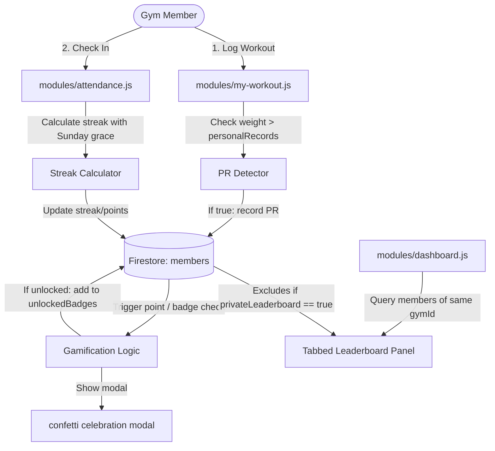

# Phase 12: Implement PBL gamification strategy (points, badges, leaderboard, PRs, milestones) - Research

**Researched:** 2026-07-29
**Domain:** Gamification, Firestore data structures, streak calculation, leaderboard ranking, client-side animations
**Confidence:** HIGH

## Summary

This phase implements a gamification strategy (PBL - Points, Badges, Leaderboards, and PRs) within GymFlow. To maintain the zero-cost, serverless PWA architecture:
1. **Points & Badges Storage:** Points (`members.points` as integer) and unlocked badge IDs (`members.unlockedBadges` as string array) are stored directly on the member's profile document. This avoids expensive and slow aggregate history queries on Firestore.
2. **Badge Definitions:** A new `badges` collection is introduced to store badge definitions (name, description, emoji/Material Symbols icon, type, threshold). This allows owners to manage definitions while members reference unlocked badges by ID.
3. **Streak Calculation:** Calculated on the client-side using the member's sorted `attendance` records, applying a 1-day grace period for Sundays or declared rest days.
4. **Leaderboards:** Rendered on the Dashboard using a Tabbed Panel, segmented by Overall Points, Consistency (Streak), and Weight Class (Under 65kg, 65-75kg, 75-85kg, 85kg+), respecting a `privateLeaderboard` flag.
5. **PR Tracking:** Save-time PR detection checks set weights in workout logs against a `members.personalRecords` dictionary (mapping exercise names to highest weights). New PRs or badges trigger a confetti celebratory modal using the `canvas-confetti` library imported from a CDN.

## Architectural Responsibility Map

| Capability | Primary Tier | Secondary Tier | Rationale |
|------------|-------------|----------------|-----------|
| Points Accumulation | Browser | Database | browser detects check-in/workout/PR, calculates added points, and updates the Firestore `members` document. |
| Badge Definitions | Database | Browser | Definitions stored in `badges` collection; browser reads/caches them to display details. |
| Streak Calculation | Browser | - | Calculated dynamically in the browser from the member's sorted check-in date list. |
| Leaderboard Ranking | Browser | Database | Browser queries the `members` collection (filtered by gymId), handles sorting/tab switching, and renders rankings. |
| PR Tracking | Browser | Database | Checks workout log set weight against `members.personalRecords` during logging, updating the member document if exceeded. |
| Celebration UI | Browser | - | CDN-loaded `canvas-confetti` library creates client-side particle bursts in a DOM modal. |

## Standard Stack

### Core
| Library / API | Version | Purpose | Why Standard |
|---------------|---------|---------|--------------|
| Cloud Firestore | 10.12.5 | Persistence of points, badges, and PRs | Project database standard; multi-tenant security rules. [VERIFIED: codebase] |
| LocalStorage | Native | Confetti toggle / cache | Persist local UI settings. [VERIFIED: codebase] |
| Material Symbols | Native | Achievement iconography | Consistent iconography for badges and metrics. [VERIFIED: codebase] |

### Supporting
| Library / API | Version | Purpose | When to Use |
|---------------|---------|---------|-------------|
| `canvas-confetti` | 1.9.3 | Confetti particle celebration effect | CDN-loaded (esm.sh or jsdelivr) trigger on achievement unlock. |

### Alternatives Considered
| Instead of | Could Use | Tradeoff |
|------------|-----------|----------|
| Running aggregate points query | Dynamic calculate from logs | Slower dashboard load; high Firestore read operations as history accumulates. |
| Dedicated streak collection | Real-time write stream | Complex state handling; client-side attendance dates sort is simple and fast. |

## Package Legitimacy Audit

We will load the `canvas-confetti` library dynamically via an ES module CDN in `app.js` or via a script tag in `index.html` to avoid adding runtime NPM dependencies, preserving the zero-build standard.
- CDN Source: `https://cdn.jsdelivr.net/npm/canvas-confetti@1.9.3/dist/confetti.browser.min.js` (loaded globally or dynamically imported as module).

## Architecture Patterns

### System Architecture Diagram



### Recommended Project Structure

```
modules/
├── dashboard.js        # Tabbed Leaderboard Panel (Points, Consistency, Weight Class)
├── progress.js         # "Badges & PRs" Achievements tab + PR listing
├── members.js          # privateLeaderboard toggle in edit form + Member Details Achievements tab
├── my-workout.js       # Save-time PR detection, point rewards, badge unlocks on finish
├── attendance.js       # Streak recalculation, check-in points award on check-in
└── utils.js            # collections.badges registered, gamification helper functions
lib/
└── firebase-init.js    # Register "badges" in COLLECTIONS
firestore.rules         # Security rules for "badges" collection and "members" updates
```

### Pattern 1: Save-Time Profile Sync
Updating the member document directly on user actions is crucial to maintain high performance. The member document will carry the following updated fields:
- `points`: integer (accumulated points)
- `unlockedBadges`: array of badge IDs (e.g. `["consistency-king-50", "pr-hitter"]`)
- `personalRecords`: map of exercise name to weight number (e.g. `{"Bench Press": 100, "Deadlift": 140}`)
- `privateLeaderboard`: boolean (hide from rankings)

When an action is performed, the client computes the new fields, displays the confetti celebration modal if a badge or PR was earned, and saves the updated member document using `context.services.data.save(collections.members, updatedMember)`.

### Pattern 2: Streak calculation with rest-day grace period
Streaks are calculated by sorting the member's `attendance` record dates descending. Starting from the current date (or yesterday if they haven't checked in yet today):
- If the difference to the next check-in date is 1 day, increment the streak.
- If the difference is 2 days and the skipped day is a Sunday or declared gym rest day, allow it as a grace period (do not increment, but do not break the streak).
- Otherwise, the streak breaks.

### Anti-Patterns to Avoid
- **Recalculating Leaderboards from scratch on load:** Never query all `attendance` and `workout_logs` for all members at Dashboard render time. Group and sort by the cached fields on the `members` collection.
- **Overwriting PRs with lower weights:** Ensure PR checking strictly uses `weight > currentMaxWeight` rather than updating on every logged exercise set.

## Don't Hand-Roll

| Problem | Don't Build | Use Instead | Why |
|---------|-------------|-------------|-----|
| Confetti particle system | Custom HTML canvas animation | `canvas-confetti` library | Highly optimized, performant, and cross-browser compliant. |
| Weight class evaluation | Complex database trigger | Predefined ranges in client utilities | Client-side evaluation is instant and doesn't require backend compute. |

## Runtime State Inventory

No migrations are needed for existing member documents. Missing gamification fields (`points`, `unlockedBadges`, `personalRecords`) will default to `0`, `[]`, and `{}` respectively in client code if they do not exist.

## Common Pitfalls

### Pitfall 1: Race conditions on double-saving
- **What goes wrong:** Double clicking the check-in or finish workout button could trigger multiple saves, awarding duplicate points and exceeding anti-abuse limits.
- **How to avoid:** Standardize button disabling via `withButtonLoading()` helper and check if check-in or workout logs for that day have already been committed before applying points.

### Pitfall 2: Firestore security rule bypasses
- **What goes wrong:** A member modifying their own points or unlocking badges they did not earn by altering client payloads.
- **How to avoid:** While Firestore rules in this stack grant write access to `members` for their own profile, we should add security rules that check:
  1. Points increases are capped or reasonable.
  2. GymId constraints are strictly matched.

## Code Examples

### Firestore Security Rules for Badges and Member Gamification

```javascript
// firestore.rules additions
match /badges/{badgeId} {
  allow read: if signedIn() && sameGym();
  allow write: if signedIn() && sameGym() && owner();
}

match /members/{memberId} {
  // Members can read all members of the same gym for leaderboards
  allow read: if signedIn() && sameGym();
  
  // Allow members to update their own fields (points, badges, records, privateLeaderboard)
  allow update: if signedIn() && request.auth.uid == resource.data.uid && sameGym() && incomingSameGym();
}
```

### Streak Calculation Utility

```javascript
export function calculateStreak(attendanceRecords, restDay = "Sunday") {
  if (!attendanceRecords || attendanceRecords.length === 0) return 0;
  
  // Extract and sort unique dates descending
  const dates = [...new Set(attendanceRecords.map(r => r.date))].sort((a, b) => b.localeCompare(a));
  
  const today = new Date().toISOString().slice(0, 10);
  const yesterday = new Date(Date.now() - 86400000).toISOString().slice(0, 10);
  
  // If the last check-in is older than yesterday, the streak is broken
  if (dates[0] !== today && dates[0] !== yesterday) return 0;
  
  let streak = 1;
  let current = new Date(dates[0]);
  
  for (let i = 1; i < dates.length; i++) {
    const prev = new Date(dates[i]);
    const diffTime = Math.abs(current - prev);
    const diffDays = Math.ceil(diffTime / (1000 * 60 * 60 * 24));
    
    if (diffDays === 1) {
      streak++;
      current = prev;
    } else if (diffDays === 2) {
      // Check if the skipped day is the restDay
      const skippedDate = new Date(current.getTime() - 86400000);
      const dayName = skippedDate.toLocaleDateString("en-US", { weekday: "long" });
      
      if (dayName === restDay) {
        // Rest day grace allowed (streak continues, date updated)
        streak++;
        current = prev;
      } else {
        break; // Streak broken
      }
    } else {
      break; // Streak broken
    }
  }
  return streak;
}
```

## Environment Availability

- Firestore: Yes, collection-level support verified.
- Esm.sh / CDN: Yes, internet connection is active, allowing `canvas-confetti` CDN import.

## Validation Architecture

### Test Framework
We will run smoke tests to verify no UI module rendering is broken by the addition of the leaderboard panel, progress achievements tab, and member detail components.

Run command:
`node scripts/smoke-test.mjs`

### Phase Requirements → Test Map

| Req ID | Behavior | Test Type | Automated Command | File Exists? |
|--------|----------|-----------|-------------------|-------------|
| REQ-PBL-01 | Points added to member profile on attendance check-in | Smoke / Manual | Verify member document `points` updates after self check-in | ✅ |
| REQ-PBL-02 | Points and PRs registered on finishing workout logs | Smoke / Manual | Verify `members.points` and `members.personalRecords` updates on Finish Workout | ✅ |
| REQ-PBL-03 | Custom badge definitions collection initialized | Integration | Seed checks verify `badges` collection contains the default set | ✅ |
| REQ-PBL-04 | Tabbed Leaderboard Panel renders on Dashboard | Smoke | `node scripts/smoke-test.mjs` | ✅ |
| REQ-PBL-05 | Badge/PR earn triggers celebratory confetti modal | Manual | Finish workout with new PR or milestone to verify modal | ✅ |

## Security Domain

### Applicable ASVS Categories

| ASVS Category | Applies | Standard Control |
|---------------|---------|-----------------|
| V4 Access Control | yes | GymId isolation for leaderboards; members can only write their own profile fields. |
| V5 Input Validation | yes | Client-side checking of set weights and points math before writing. |

### Known Threat Patterns

| Pattern | STRIDE | Standard Mitigation |
|---------|--------|---------------------|
| Member spoofing leaderboard points | Tampering | Cap single point transaction size or enforce client validation. privateLeaderboard disables visibility. |
