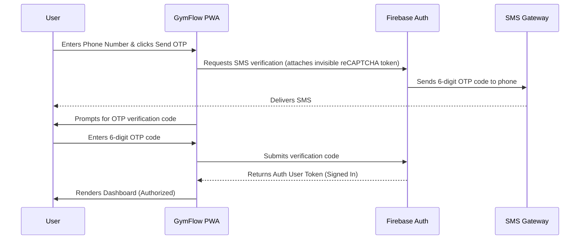

# Phase 13 Research: Firebase Phone Authentication & WhatsApp Invitation Links

## 1. Firebase Phone Authentication Cost Analysis

Firebase Authentication provides Phone Number Sign-in capability. Here is the pricing breakdown:

| Plan | Tier / Limit | Cost per Verification | Notes |
|------|--------------|-----------------------|-------|
| **Spark Plan (Free)** | Up to **10,000** SMS/month | **$0.00** | Reset monthly. Good for small/medium gyms. |
| **Blaze Plan (Pay-as-you-go)** | First 10,000 SMS/month | **$0.00** | Free tier still applies. |
| **Blaze Plan (US/Canada)** | Above 10,000 SMS/month | **$0.01 / SMS** | Extremely cost-effective (~80 paise INR). |
| **Blaze Plan (India)** | Above 10,000 SMS/month | **$0.008 to $0.015 / SMS** | Cost varies dynamically by telecom regulations (~1.20 INR). |

> [!NOTE]
> For almost all local and boutique gyms, the **10,000 free monthly verifications** are more than sufficient. You will not incur any cost unless the gym grows to thousands of active daily logins.

---

## 2. Technical Feasibility: Dual Login (Email vs. Phone)

We can support **both** email-based and phone-based logins. Here is how they compare and how we can implement them:

### Option A: Unified Login Page (Recommended)
*   **How it works:** A single text field that accepts either an email or a phone number.
*   **UX Flow:**
    *   If the input contains `@`, show the Password input field and proceed with standard Firebase Email/Password auth.
    *   If the input is a 10-digit number (or matches phone format), hide the password field, show a "Send OTP" button, and trigger the SMS verification flow.
*   **Pros:** Modern, seamless UX. Users don't have to choose a method upfront.

### Option B: Linked Credentials (Best for Account Integrity)
*   If a member registers with their phone number, their profile can have an associated email address.
*   Firebase allows linking multiple credentials to the same user:
    ```javascript
    // Link email password credential to phone authenticated user
    firebase.auth().currentUser.linkWithCredential(emailCredential);
    ```

---

## 3. Firebase Phone Authentication Flow in Web/PWA

Phone auth on the web requires protection against automated spam (which would quickly drain the 10,000 free SMS limit). Firebase enforces this using **reCAPTCHA**:

1.  **Invisible reCAPTCHA (Best UX):**
    *   The app creates a hidden reCAPTCHA verifier:
        ```javascript
        const appVerifier = new firebase.auth.RecaptchaVerifier('send-otp-btn', {
          'size': 'invisible'
        });
        ```
    *   It only displays a challenge if it detects suspicious user behavior. Otherwise, it triggers the SMS instantly.
2.  **Visible reCAPTCHA:**
    *   Displays the standard "I'm not a robot" checkbox. Best avoided for mobile viewports due to layout space.

### Web OTP Flow:


---

## 4. Owner Registration & WhatsApp Invitation Flow

To enroll new members, we will implement a smooth registration-to-invite pipeline:

1.  **Enrolling the Member:**
    *   Owner adds member with Name, Phone, and (optional) Email.
    *   The member document is saved in the `members` collection with status `Pending`.
2.  **Generating the Invite:**
    *   Upon successful save, an "Invite Member" option appears.
    *   Clicking it triggers a WhatsApp Web / App link (`https://wa.me/`) with pre-filled, URL-encoded text.
3.  **Pre-filled Message Content:**
    ```text
    Hello [Member Name]! Welcome to [Gym Name]. 

    To register and access your workouts, schedules, and consistency points, please open the GymFlow App:
    [AppURL]/?invite=[MemberId]&phone=[PhoneNumber]

    Let's get stronger together! 💪
    ```
4.  **First-Time Sign-in UX:**
    *   When the member clicks the link, the App opens.
    *   It reads `invite` and `phone` parameters from the query string.
    *   It automatically pre-fills the Phone login screen.
    *   The user clicks "Verify Phone", receives the OTP, and logs in.
    *   The system matches the authenticated phone number with the `Pending` member document, links the Firebase UID, and changes status to `Active`.
